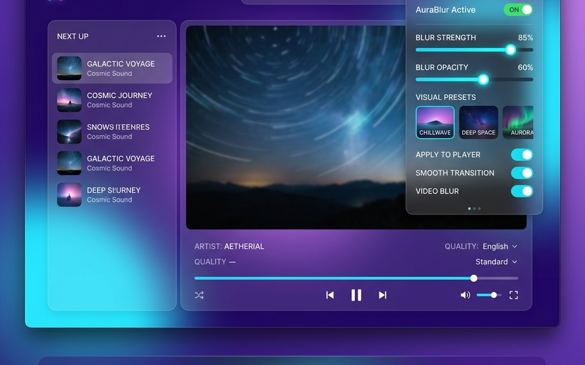

# 🌌 AuraBlur: Glassmorphic & Privacy Shield
> **A premium, high-performance browser extension that dynamically applies elegant frosted-glass styling and customizable privacy shields to light workspaces in real-time.**

<p align="center">
  
</p>

<p align="center">
  
  
  
  
</p>

---

## 📸 Interface Preview

Here is a look at the **AuraBlur Control Panel**, highlighting its premium dark glassmorphic styling, HSL gradients, and customized privacy filters:

<p align="center">
  
</p>

---

## ✨ Features

### 🎨 1. Aura Glassmorphism Customizer
Transform harsh, stark-white web pages and bright layout sections into sleek, premium frosted-glass interfaces in real-time.
*   **Vibrant & Light Color Detection**: Automatically scans elements, evaluates computed background colors, and applies glassmorphic styling exclusively to light components.
*   **Customizer Sliders**:
    *   **Blur Radius**: Fine-tune the background frosted glass blur from `0px` to `30px`.
    *   **Backdrop Opacity**: Control the glass backing sheet's transparency from `0%` to `100%`.
    *   **Detection Sensitivity**: Adjust how aggressively the extension targets bright layout blocks.

### 🛡️ 2. Privacy Guard (Mask & Reveal)
Protect your screen from shoulder surfers and accidental exposure of sensitive details.
*   **Blur Images & Videos**: Mask all media containers (`img`, `video`, `iframe`, `canvas`) until hovered.
*   **Blur Input Fields**: Hide active forms, credit card entries, and search bars.
*   **Blur Reading Text**: Conceal articles, paragraphs, and blockquotes behind clean frosted bars.
*   **Sensitive Credentials Mask**: Intelligently identifies and blurs emails, credit card formats, phone numbers, and financial balances using a local regex engine.
*   **Hover to Reveal**: Seamlessly reveal any blurred element temporarily by hovering your cursor over it.

### 🎭 3. Visual Presets
Choose from four beautifully crafted, preset styling models with one click:
*   ❄️ **Frosted**: Classic white glass with light specular reflections.
*   🌙 **Midnight**: Dark, obsidian glassmorphism for a high-end dark mode look.
*   🌌 **Cyber Neon**: Hyper-glowing violet neon glass style.
*   🛡️ **Privacy**: Instant full-mask privacy layout with all blur options engaged.

### 🚀 4. Site-Specific Whitelisting
Enable or disable AuraBlur on a per-site basis instantly using the integrated control panel toggle.

---

## 🛠️ Technical Deep-Dive (Under the Hood)

AuraBlur is engineered for **ultra-low performance overhead** and high frame-rate rendering, even on highly dynamic, complex web applications.

### ⚡ 1. Mutation Observer with Idle-Time Scheduling
To avoid performance bottlenecking, AuraBlur doesn't scan the page recursively on intervals. Instead, it listens to DOM changes using a `MutationObserver`. It schedules DOM scans using `window.requestIdleCallback` (falling back to `requestAnimationFrame`), completely eliminating layout thrashing during heavy page changes or AJAX loads.

### 🎨 2. Zero-Redraw Style Engine
Sliders modify the glassmorphic styling instantly without forcing the browser to redraw the whole page DOM. By utilizing native CSS custom variables declared on the `:root`, changes to properties like `--aura-blur-amount` or `--aura-bg-color` update the visual output immediately inside the GPU rasterizer.

### 🛡️ 3. Safe Leaf-Node Pattern Matching
To prevent breaking modern web page structures (such as layout-breaking structural divs), AuraBlur's local regex parsing and styling target **only leaf-nodes** (elements with no child elements). This ensures text matching for emails, phone numbers, or balances blurs only the precise text container itself.

```javascript
// Local regex engine targeting standard sensitive formats
const credRegex = /(?:[a-zA-Z0-9._%+-]+@[a-zA-Z0-9.-]+\.[a-zA-Z]{2,})|(?:\b(?:\d[ -]*?){13,16}\b)|(?:\+?\d{1,4}?[-.\s]?\(?\d{1,3}?\)?[-.\s]?\d{1,4}[-.\s]?\d{1,4}[-.\s]?\d{1,9})|(?:\$|£|€|¥|₹)\s?\d{1,3}(?:[.,]\d{3})*(?:[.,]\d{2})?/;
```

---

## 📁 File Structure

The project has been streamlined and optimized to contain only the necessary, high-performance files:
```text
AuraBlur/
├── content.js         # Core privacy & color detection engine
├── manifest.json      # Extension permissions, scripts, and asset mappings
├── popup.html         # Control panel structural layout
├── popup.js           # Interactive UI settings controller
├── styles.css         # CSS classes for glassmorphic styling and masks
├── icon-16.png        # Extension toolbar icon (16x16)
├── icon-32.png        # High-DPI screen icon (32x32)
├── icon-48.png        # Management page icon (48x48)
└── icon-128.png       # Web Store listing icon (128x128)
```

---

## 🛠️ Local Installation (Developer Mode)

To run AuraBlur locally on your browser completely for free:

1. Clone or download this repository as a `.zip` file and extract it.
2. Open your browser's extension manager:
   * **Chrome**: Go to `chrome://extensions`
   * **Edge**: Go to `edge://extensions`
3. Toggle the **"Developer Mode"** switch in the top-right corner.
4. Click the **"Load unpacked"** button in the top-left.
5. Select the folder containing these files.
6. Open the extension, configure your settings, and enjoy!

---

## 🔒 Privacy First

AuraBlur is built with an offline-first architecture to guarantee your privacy:
*   **Zero Data Collection**: We do not collect, store, or transmit any browsing history, credentials, or personal information.
*   **100% Local Processing**: All content scanning and masking run inside your browser's local memory—no external API requests are ever made.
